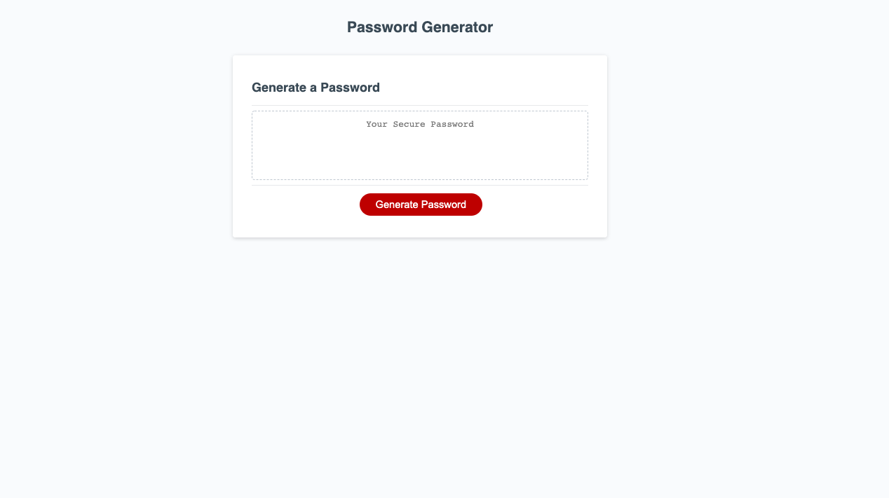
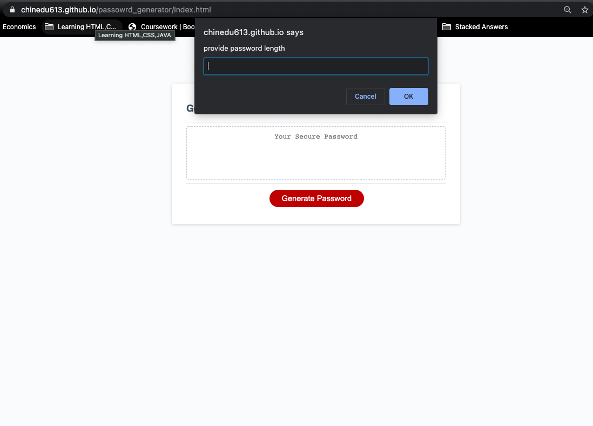
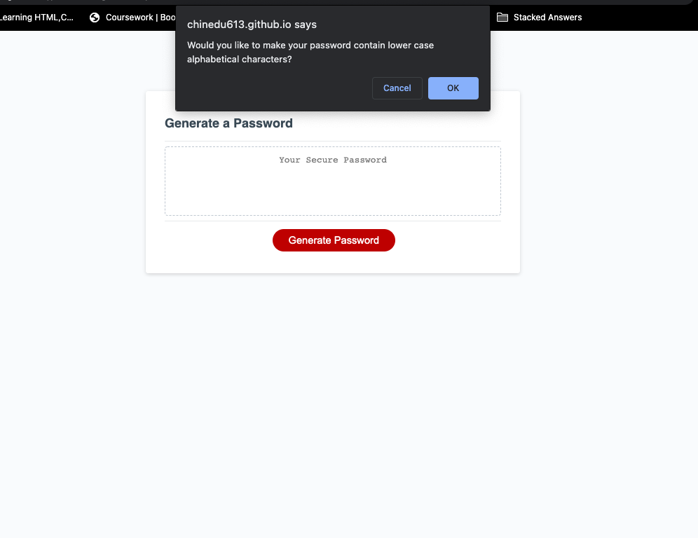
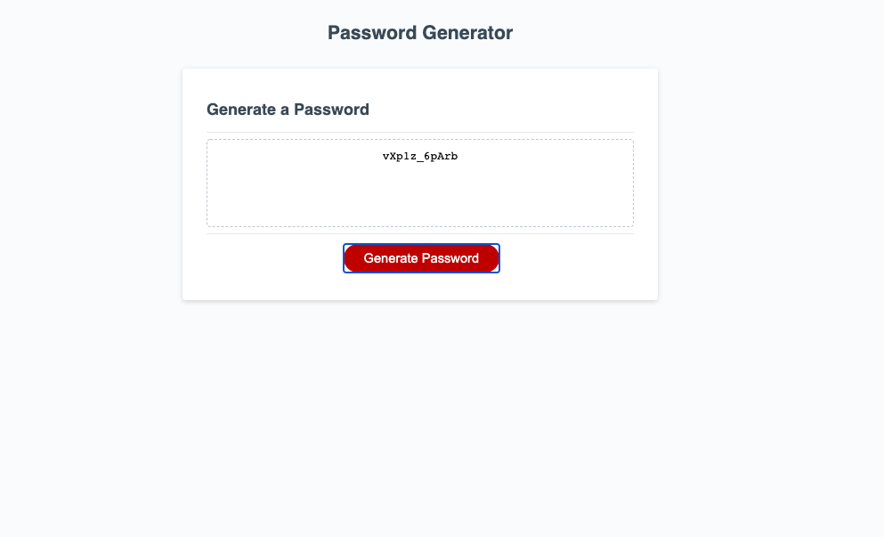

# Password Generator

## Description

    As an  employee with access to sensitive data. I have created a password generator that will 
    create a password between the length of 8 and 125 characters. You can choose uppercase, 
    lower case letters, numbers, and special characters.

    The password will be generated at random and once you click the generate password button.

## Usage

    To use this generator, follow the prompts at the top of the window:

    * Click Generate Password
    * Input Password Lenghth
    * Comfirm Password type (Uppercase, Lower Case, Numbers, & Special Characters)

